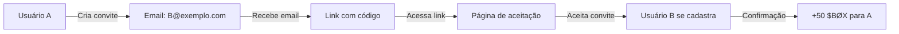

# 🎁 Sistema de Convites - INTERBØX V2

## 📋 Visão Geral

O sistema de convites implementa um mecanismo completo de indicações com recompensas automáticas de **+50 $BØX** para cada convite aceito.

## 🏗️ Arquitetura

### 1. **Banco de Dados** (`supabase/invites-table.sql`)
- ✅ Tabela `invites` com RLS habilitado
- ✅ Coluna `referral_code` na tabela `users`
- ✅ Funções RPC: `create_invite`, `accept_invite`, `get_invite_stats`
- ✅ Triggers automáticos e limpeza de convites expirados
- ✅ Views úteis para consultas

### 2. **Hook Principal** (`src/hooks/useInviteSystem.ts`)
- ✅ `createInvite()` - Cria novo convite
- ✅ `acceptInvite()` - Aceita convite via código
- ✅ `cancelInvite()` - Cancela convite pendente
- ✅ `resendInvite()` - Reenvia convite expirado
- ✅ `fetchInvites()` - Lista convites do usuário
- ✅ `fetchStats()` - Estatísticas de convites
- ✅ `shareInvite()` - Compartilhamento via Web Share API

### 3. **Componente UI** (`src/components/InviteSystem.tsx`)
- ✅ Interface completa de gerenciamento
- ✅ Formulários de criação e aceitação
- ✅ Lista de convites com status
- ✅ Estatísticas em tempo real
- ✅ Página de aceitação de convite

## 🚀 Como Usar

### 1. **Criar Convite**

```typescript
import { useInviteSystem } from '../hooks/useInviteSystem';

function MyComponent() {
  const { createInvite } = useInviteSystem();
  
  const handleCreateInvite = async () => {
    const result = await createInvite({
      inviteeEmail: 'amigo@exemplo.com',
      message: 'Junte-se ao INTERBØX!',
      metadata: { source: 'dashboard' }
    });
    
    if (result.success) {
      console.log('Convite criado:', result.referralCode);
    }
  };
}
```

### 2. **Aceitar Convite**

```typescript
import { useInviteSystem } from '../hooks/useInviteSystem';

function AcceptInvitePage() {
  const { acceptInvite } = useInviteSystem();
  
  const handleAcceptInvite = async (referralCode: string) => {
    const result = await acceptInvite(referralCode);
    
    if (result.success) {
      console.log('Convite aceito! Tokens:', result.tokensAwarded);
    }
  };
}
```

### 3. **Compartilhar Convite**

```typescript
import { useInviteSystem } from '../hooks/useInviteSystem';

function ShareButton() {
  const { shareInvite, referralCode } = useInviteSystem();
  
  const handleShare = async () => {
    if (referralCode) {
      await shareInvite(referralCode, 'Junte-se ao INTERBØX!');
    }
  };
}
```

## 🎯 Fluxo de Recompensas

### 1. **Usuário A convida Usuário B**


### 2. **Validações Automáticas**
- ✅ **Email único**: Não permite convites duplicados
- ✅ **Expiração**: Convites expiram em 30 dias
- ✅ **Status tracking**: pending → accepted/expired/cancelled
- ✅ **Rate limiting**: Previne spam de convites
- ✅ **Auditoria**: Logs completos de todas as ações

## 📊 Estatísticas Disponíveis

```typescript
interface InviteStats {
  totalSent: number;        // Total de convites enviados
  totalAccepted: number;    // Total de convites aceitos
  totalPending: number;     // Total de convites pendentes
  totalExpired: number;     // Total de convites expirados
  totalTokensEarned: number; // Total de $BØX ganhos
}
```

## 🔧 Configuração

### 1. **Executar SQL no Supabase**
```sql
-- Executar o arquivo supabase/invites-table.sql
-- Isso criará todas as tabelas, funções e políticas necessárias
```

### 2. **Adicionar Componente**
```tsx
import InviteSystem from '../components/InviteSystem';

function ProfilePage() {
  return (
    <div>
      <h1>Meu Perfil</h1>
      <InviteSystem />
    </div>
  );
}
```

### 3. **Rota para Aceitação**
```tsx
// Em seu roteador
<Route path="/convite/:referralCode" element={<AcceptInvitePage />} />
```

## 🛡️ Segurança

### 1. **Row Level Security (RLS)**
- ✅ Usuários só veem seus próprios convites
- ✅ Staff pode ver todos os convites
- ✅ Validação de propriedade em todas as operações

### 2. **Validações**
- ✅ Email válido obrigatório
- ✅ Código de referência único
- ✅ Prevenção de convites duplicados
- ✅ Verificação de expiração

### 3. **Auditoria**
- ✅ Logs de criação de convites
- ✅ Logs de aceitação de convites
- ✅ Logs de concessão de tokens
- ✅ Metadados completos para rastreamento

## 📈 Performance

### 1. **Índices Otimizados**
```sql
-- Índices para consultas rápidas
CREATE INDEX idx_invites_inviter_id ON invites(inviter_id);
CREATE INDEX idx_invites_invitee_email ON invites(invitee_email);
CREATE INDEX idx_invites_referral_code ON invites(referral_code);
CREATE INDEX idx_invites_status ON invites(status);
```

### 2. **Cache de Estatísticas**
- ✅ Estatísticas são calculadas via RPC
- ✅ Cache automático no hook
- ✅ Refresh em tempo real opcional

## 🧪 Testes

### 1. **Teste de Criação**
```typescript
const result = await createInvite({
  inviteeEmail: 'test@exemplo.com',
  message: 'Teste'
});
expect(result.success).toBe(true);
expect(result.referralCode).toBeDefined();
```

### 2. **Teste de Aceitação**
```typescript
const result = await acceptInvite('ABC12345');
expect(result.success).toBe(true);
expect(result.tokensAwarded).toBe(50);
```

## 🚨 Troubleshooting

### 1. **Convite não criado**
- Verificar se usuário está autenticado
- Verificar se email é válido
- Verificar se não há convite pendente para o email

### 2. **Convite não aceito**
- Verificar se código existe e não expirou
- Verificar se usuário não aceitou o convite antes
- Verificar se usuário está autenticado

### 3. **Tokens não concedidos**
- Verificar se função `add_tokens` está funcionando
- Verificar logs de auditoria
- Verificar se RLS está configurado corretamente

## 📝 Logs e Monitoramento

### 1. **Eventos de Gamificação**
```typescript
// Todos os convites geram eventos
{
  action: 'indicacao_confirmada',
  tokens: 50,
  metadata: {
    inviteeId: 'user_123',
    referralCode: 'ABC12345'
  }
}
```

### 2. **Métricas de Negócio**
- Taxa de conversão de convites
- Tempo médio de aceitação
- Distribuição de convites por usuário
- ROI do sistema de indicações

## 🔄 Manutenção

### 1. **Limpeza Automática**
```sql
-- Executar periodicamente para limpar convites expirados
SELECT cleanup_expired_invites();
```

### 2. **Backup de Dados**
- Tabela `invites` deve ser incluída no backup
- Dados de auditoria são críticos
- Códigos de referência são únicos e não devem ser perdidos

## 🎉 Benefícios

### 1. **Para Usuários**
- ✅ Ganham +50 $BØX por indicação
- ✅ Interface simples e intuitiva
- ✅ Compartilhamento fácil
- ✅ Acompanhamento de status

### 2. **Para o Negócio**
- ✅ Crescimento orgânico
- ✅ Engajamento aumentado
- ✅ Dados de referência valiosos
- ✅ Sistema escalável e confiável

## 📞 Suporte

Para dúvidas ou problemas:
1. Verificar logs de erro no console
2. Verificar status do convite no banco
3. Verificar configuração do RLS
4. Verificar funções RPC no Supabase
